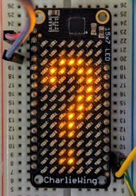

pwm_lightness module
====================

Generates lightness correction tables for eyeball pleasing LED brightness.

Want a smooth fade on your pulsing LEDs? Want antialiasing on LED matrix fonts?
Use this library to correct your raw linear brightness values for human eyeball
persistence of vision perception sensitivity.

The adjustment is otherwise known as the `CIE 1931 Lightness
curve <https://www.photonstophotos.net/GeneralTopics/Exposure/Psychometric_Lightness_and_Gamma.htm>`_.
It is also `covered in many
books <https://www.google.com/search?q=903.3+116+formula+-chinese&tbm=bks>`_.
The research was done in the 1920s, winding up as one part of the International
Commission on Illumination (CIE) 1931 standard.

This module does work on CircuitPython (and MicroPython if you build with
floating point enabled).  In microcontroller environments recomputing a table
on device is often overkill.  Precompute the table(s) you need using this
library and store them as data to save precious RAM.

Smoothly fade an LED
--------------------

*This example assumes `CircuitPython <https://circuitpython.org/>`_ or
`adafruit-blinka <https://pypi.org/project/Adafruit-Blinka/>`_.*

.. code-block:: python

   import time, board, pwmio, pwm_lightness
   PWM = pwm_lightness.get_pwm_table(0xffff, max_input=100)
   output_pin = pwmio.PWMOut(board.D13)
   while True:
       for v in range(100, -1, -1):
           output_pin.duty_cycle = PWM[v]
           time.sleep(0.02)
       for v in range(1, 100):
           output_pin.duty_cycle = PWM[v]
           time.sleep(0.02)

It is similarly useful with the RGB values you send to programmable LED strips.

Pre-generate a PWM table for use on a microcontroller
-----------------------------------------------------

.. code-block:: bash

   $ python3 -m pwm_lightness --help
   ...
   RuntimeError:  Usage:  python3 -m pwm_lightness MAX_OUTPUT [MAX_INPUT]
       MAX_OUTPUT:  The maximum integer output value.
       MAX_INPUT:   The number of entries in the generated lookup table.
   $ python3 -m pwm_lightness 88 32
   0,0,1,1,1,2,2,3,4,5,6,7,9,10,12,14,16,19,21,24,27,31,34,38,42,47,52,57,63,68,75,81,88

You can use these tables as initializers in arrays in any language.

Improve antialiased fonts or other 8-bit images
-----------------------------------------------

Shown here using `Pillow <https://pypi.org/project/Pillow/>`_ to make an
antialiased font shine rather than appearing as a bold blur:\ :raw-html-m2r:` `
*This example assumes a RPi connected to an `I2C Adafruit charlieplexed
LED matrix <https://www.adafruit.com/?q=IS31FL3731>`_.*

.. code-block:: python

   import pwm_lightness
   PWM = pwm_lightness.get_pwm_table(60)  # 0..255 is our max LED PWM value.
   import board, busio, adafruit_is31fl3731, PIL
   i2c = busio.I2C(board.SCL, board.SDA)
   led_matrix = adafruit_is31fl3731.CharlieBonnet(i2c)
   font = PIL.ImageFont.truetype('fonts/RobotoCondensed-Regular.ttf', 16)
   image = PIL.Image.new('L', (led_matrix.height, led_matrix.width), 0)
   draw = PIL.ImageDraw.Draw(image)
   # fill=255 gives us the most antialiasing detail to work with.  Control
   # brightness using the max_output value passed to get_pwm_table() above.
   draw.text((0,-1), '?', fill=255, font=font)
   image = image.point(PWM)  # Corrects linear 0..255 values for PWM lightness.
   image = image.transpose(PIL.Image.ROTATE_90)  # Match the matrix orientation.
   led_matrix.image(image)  # Send pixels to our LED display.
